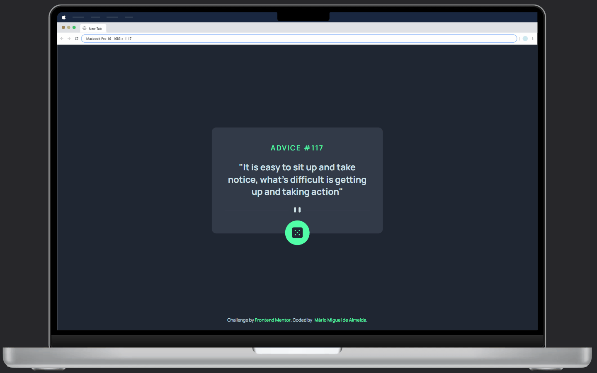
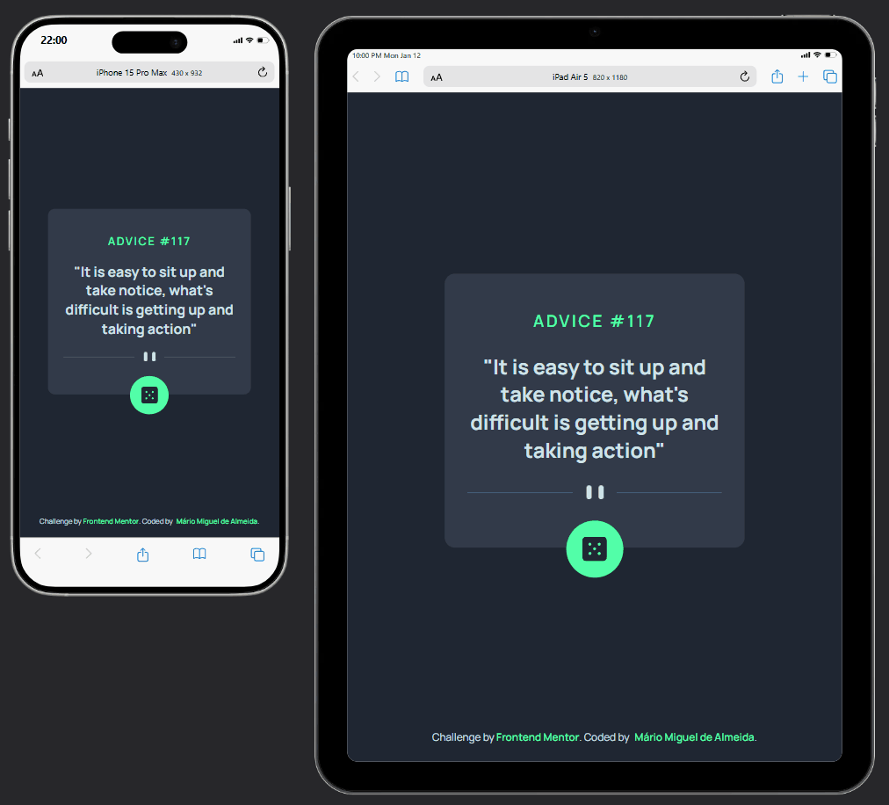
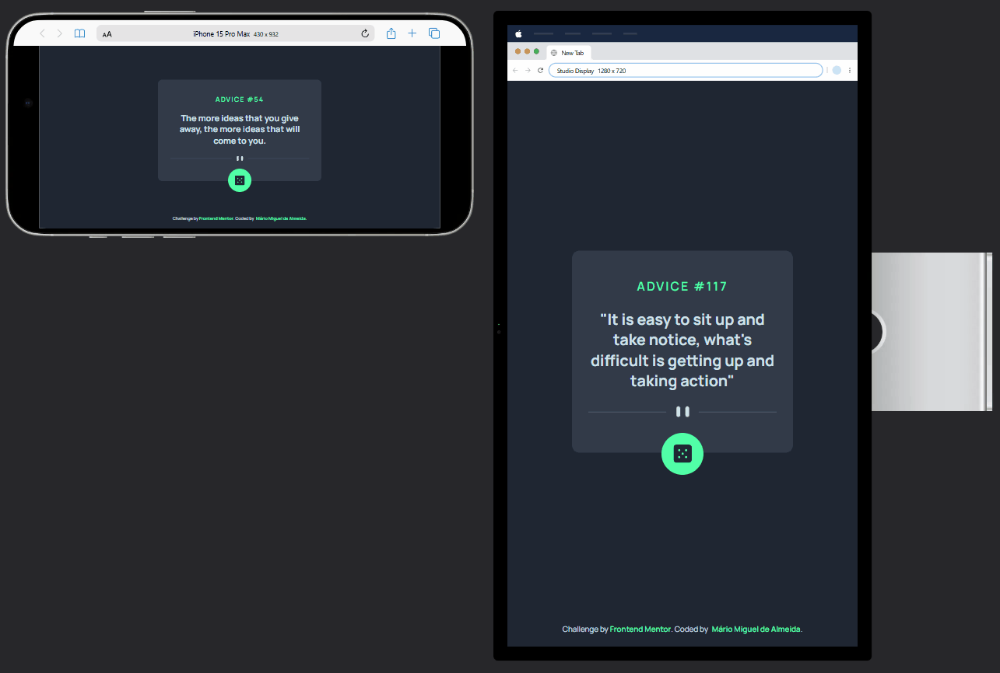

# Advice Generator Project | Exercício DevQuest

## **Sumário**

- [Visualização do Projeto](#visualização-do-projeto)
- [Apresentação](#apresentação)
- [Explicação do Projeto](#explicação-do-projeto)
- [Estrutura do Projeto](#estrutura-do-projeto)
- [Como Utilizar o Código do Projeto](#como-utilizar-o-código-do-projeto)
- [Ferramentas e Tecnologias Utilizadas](#ferramentas-e-tecnologias-utilizadas)
- [Principais Recursos e Abordagens](#principais-recursos-e-abordagens)
- [Desafios Enfrentados](#desafios-enfrentados)
- [Aprendizado Adquirido](#aprendizado-adquirido)
- [Desenvolvimento Contínuo e Autossuperação](#desenvolvimento-contínuo-e-autossuperação)
- [Agradecimentos e Conclusão](#agradecimentos-e-conclusão)
- [Contato](#contato)
- [Licença de Uso](#licença-de-uso)

## **Visualização do projeto**

### **🖥️ Desktop**

<div align="center" >
  
</div>

### **📱 Mobile**

<div align="center">
  
</div>

### **Orientação Invertida**

<div align="center">
  
</div>

### [Acesse a página clicando aqui!](https://miguel-dalmeida.github.io/advice-generator__project/) 

## **Apresentação**

Olá! Meu nome é Mário Miguel e sou estudante de Desenvolvimento Web. Atualmente, sou aluno do curso **DevQuest**, da plataforma *Dev em Dobro*, focado na formação de desenvolvedores Fullstack.

Como parte da minha jornada de aprendizado, desenvolvi a aplicação **Advice Generator**. Este projeto integra o módulo [**Exercício JavaScript Avançado**](https://gigantic-chef-a6f.notion.site/Exerc-cio-JavaScript-Avan-ado-2bbcd10b93ab806e81d8ef6bde9f7e1f?source=copy_link) do curso *DevQuest* e tem como objetivo colocar em prática os conhecimentos adquiridos no módulo teórico de **JavaScript Avançado**, explorando conceitos mais aprofundados da linguagem.

## **Explicação do Projeto**

Este projeto consiste em um gerador simples de conselhos que consome a API [**Advice Slip JSON**](https://api.adviceslip.com/#endpoint-random), responsável por disponibilizar milhões de conselhos ao longo do ano.

A aplicação exibe um card centralizado na tela contendo o **ID do conselho** e o **texto do conselho**. Além disso, há um botão interativo que, ao ser clicado, realiza uma nova requisição à API e atualiza o conteúdo exibido, apresentando um novo conselho ao usuário.

## **Estrutura do Projeto**

```plaintext
├── src/
│   ├── css/
│   │   ├── reset.css
│   │   ├── responsive.css
│   │   ├── style.css
│   ├── js/
│   │   ├── index.js
│   ├── design/
│   │   ├── ...
│   ├── images/
│   │   ├── ...
├── index.html
├── README.md
```

## **Como Utilizar o Código do Projeto**

**Para rodar este projeto em sua máquina local, siga os passos abaixo:**

### 1️⃣ Crie um diretório para o projeto  
Escolha um local no seu computador e crie uma pasta para armazenar os arquivos do projeto.

### 2️⃣ Acesse o terminal  
Clique com o botão direito sobre a pasta criada e selecione a opção para abrir o terminal.  

### 3️⃣ Clone o repositório  
No terminal, execute o seguinte comando para clonar o repositório:  
```sh
git clone https://github.com/Miguel-dAlmeida/advice-generator__project.git
```
### 4️⃣ Acesse o diretório do projeto
Após a clonagem, entre na pasta do projeto executando o comando abaixo em seu terminal:

```sh
cd advice-generator__project
```

### 5️⃣ Abra o projeto no editor de código
Ainda no terminal, caso esteja utilizando o VS Code, basta rodar o comando:

```sh
code .
```
Se estiver utilizando outro editor, abra a pasta `advice-generator__project` manualmente no programa de sua escolha.

**Pronto! Agora você pode explorar e editar o código do projeto.** 

## **Ferramentas e Tecnologias Utilizadas**

<div style="display: inline_block" align="center"><br>
  
  
  
  
</div>

## **Principais Recursos e Abordagens**

*Este projeto foi desenvolvido considerando boas práticas em front-end, com foco em acessibilidade, estrutura semântica, responsividade, interatividade, escalabilidade e desempenho. **A seguir, compartilho um resumo dos principais recursos e estratégias adotadas:***

### HTML

- **Tags Semânticas:**  
  A estrutura do projeto foi cuidadosamente montada com tags semânticas como `<main>`, `<picture>` e `<footer>`. Essa escolha não apenas organiza e torna o código mais legível, mas também melhora a acessibilidade e a indexação pelo SEO.

- **Atributos:**  
  Utilizei atributos HTML para aprimorar a acessibilidade do site, como `aria-label` e `alt`, e também para estruturar melhor a lógica em JavaScript, com o `id`.

- **Imagens Responsivas via `<picture>`:**  
  Utilizei a tag `<picture>` para gerenciar a renderização condicional de imagens de acordo com o dispositivo. Como o layout prevê imagens distintas para mobile e desktop, essa abordagem permite carregar apenas o recurso necessário em cada contexto, evitando duplicações no HTML e "gambiarras" via CSS (*esconder com `display: none;`, por exemplo*), além de contribuir para um melhor desempenho (*uma renderização por vez; economia de banda*).


### CSS

- **CSS Flexbox:**  
  O Flexbox foi utilizado como principal mecanismo de layout, permitindo alinhar e distribuir os elementos da página de forma eficiente e responsiva.

- **Prefixos `-webkit-`, `-ms-` e `-o-`:**  
  Inclusão de prefixos em propriedades CSS para garantir compatibilidade com versões antigas de navegadores.  
***Nota:** Utilizei o site [Autoprefixer CSS online](https://autoprefixer.github.io/) para incluir os prefixos automaticamente.*
- **Favicon Personalizado:**  
  Utilizei um favicon para reforçar a identidade visual da aplicação.

- **Reset CSS:**  
  Utilizei um arquivo de reset para eliminar inconsistências entre navegadores, criando uma base uniforme para os estilos aplicados.

- **Uso Estratégico de REM:**  
  Diferentemente de outros projetos, mantive o valor padrão do `root` em 16px (`html { font-size: 100% }`), abrindo mão da conveniência matemática do `62.5%` em favor da acessibilidade. Essa decisão garante maior previsibilidade no zoom do navegador e melhor compatibilidade com preferências do usuário. Em conjunto, utilizei a unidade `rem` para definir tamanhos e espaçamentos, assegurando escalabilidade consistente em diferentes resoluções.

- **CSS Nesting:**  
  A técnica de CSS Nesting foi empregada para estruturar os estilos de forma hierárquica, o que minimiza a repetição de regras e torna o código mais legível e organizado, criando uma estrutura semelhante à encontrada no código HTML.

- **Nomenclatura de Classes com BEM (Block, Element, Modifier):**  
  Todas as classes seguem a metodologia BEM, o que proporciona clareza, modularidade e escalabilidade ao CSS. Essa padronização também facilita a manutenção e me prepara tanto para, futuramente, trabalhar em equipe, quanto para projetos mais complexos.

- **Abordagem Mobile First:**  
  Iniciei o desenvolvimento com foco em telas mobile e fui adaptando progressivamente para dispositivos desktop, como notebooks e monitores maiores.

- **Media Queries:**  
  O uso de media queries permitiu ajustar o layout conforme o tamanho da tela, garantindo uma experiência consistente em todos os dispositivos.

- **Posicionamento Avançado:**  
  Utilizando os valores `relative` e `absolute` da propriedade `position`, pude criar contextos de empilhamento e controlar sobreposições, replicando fielmente o design.

- **Função `clamp()` para dimensionamento fluido:**  
  Empreguei a função `clamp()` para lidar com a responsividade em dispositivos mobile (orientation: portrait). Definindo valores mínimo, ideal e máximo, foi possível criar um dimensionamento fluido do `font-size`, atendendo a diferentes larguras de tela com um único breakpoint e uma única regra CSS, mantendo coesão visual e simplicidade no código.  
  ```css
  @media (min-width: 320px) and (orientation: portrait) {
  html {
    font-size: clamp(1rem, 2.2727vw + 0.54545rem, 2rem);
    }
  }
  ```

- **Breakpoints para dimensionamento responsivo:**  
  Para o layout desktop, optei por uma abordagem mais convencional utilizando breakpoints aliados à unidade `rem`. Após testes com `clamp()`, percebi limitações relacionadas à previsibilidade do comportamento do zoom, o que motivou a adoção dessa estratégia mais estável e amplamente consolidada.

### JavaScript

- **Seleção de Elementos com `getElementById()`:**
  A lógica começa com a seleção dos elementos HTML via `document.getElementById()`. Isso possibilita capturar os elementos importante para a lógica e prepará-los para manipulação.

- **Eventos de Clique com `addEventListener()`:**  
  Implementei o método `addEventListener("click", ...)` no botão gerador de conselhos, permitindo capturar a interação do usuário e disparar a função responsável por realizar a requisição à API e atualizar dinamicamente o conteúdo exibido.

- **Uso das palavras-chave `async` e `await`:**  
  Para lidar com operações assíncronas envolvendo requisições HTTP, utilizei `async` e `await`, garantindo que o código aguarde corretamente a resposta da API antes de prosseguir com a manipulação dos dados.

- **Requisições com `fetch()` e método `.json()`:**  
  A comunicação com a API foi realizada por meio da função `fetch()`, seguida da conversão da resposta para um objeto JavaScript utilizando o método `.json()`, possibilitando o acesso e a manipulação dos dados retornados de forma eficiente.-

- **Tratamento de erros com `try` e `catch`:**  
  Como boa prática, implementei o tratamento de erros utilizando `try` e `catch`, prevenindo que falhas na requisição ou no processamento dos dados comprometam a execução da aplicação, além de permitir a exibição de mensagens apropriadas em cenários inesperados.

- **Uso de `.innerText`:**  
  A atualização do conteúdo textual na interface foi realizada por meio da propriedade `.innerText`, garantindo que os conselhos retornados pela API fossem inseridos no DOM de forma segura e direta.

### Padronização
- **Organização Lógica das Propriedades CSS:**  
  Agrupei as propriedades CSS de forma lógica (box model, tipografia, layout etc.), de modo a manter o código previsível e fácil de ler.

- **Nomenclatura Descritiva do Código:** Busquei utilizar nomes claros e significativos para funções, variáveis e classes. Essa prática torna o código mais autoexplicativo e reduz a necessidade de comentários excessivos, além de facilitar revisões e colaborações futuras.

- **Uso de *Header Comments*:** Implementei comentários padronizados no topo dos arquivos CSS e JS com informações como o propósito do arquivo, autor, data da última modificação e dependências envolvidas. 
Mesmo o projeto sendo pequeno, decidi usar essa padronização para ir me acostumando com boas práticas de código limpo — afinal, logo serei um desenvolvedor contratado, atuando numa equipe de desenvolvimento real.


### Extra: Inteligência Artificial

Durante o desenvolvimento deste projeto, contei com o apoio das IAs, como **ChatGPT**, **Claude** e **Microsoft Copilot**. Elas funcionaram como verdadeiras assistentes, ajudando a esclarecer dúvidas técnicas, resolver desafios complexos e refinar o código (estrutura, semântica, coesão, escalabilidade etc.).

Além disso, as IAs contribuíram para a organização das minhas anotações e para o aprimoramento deste README, elevando a clareza e a qualidade da documentação. Vale destacar que, embora essas ferramentas tenham sido primordiais, o projeto é majoritariamente autoral, resultado da minha criatividade e esforço, com os quais consegui produzir uma solução única e original.

## **Desafios Enfrentados**

Embora o **Advice Generator** tenha sido proposto para avaliar habilidades em JavaScript — especialmente no consumo de APIs —, de forma contraintuitiva, o maior desafio deste projeto não esteve na lógica JS, mas sim na **responsividade**. Essa experiência foi semelhante ao que ocorreu no projeto [**Image Slider**](https://github.com/Miguel-dAlmeida/slider-image_project), cujo objetivo principal era testar a manipulação de classes via JavaScript, mas cujos obstáculos mais significativos acabaram surgindo no CSS.

A marcação HTML fluiu de forma tranquila, assim como a estilização base. Adotei a metodologia **Mobile First**, de modo que o arquivo `style.css` representa o layout mobile, enquanto as adaptações para desktop ficaram concentradas no arquivo responsável pela responsividade — ponto ao qual retornarei mais adiante. Já a lógica em JavaScript fluiu melhor do que o esperado: consegui estruturar toda a funcionalidade em menos de 15 minutos, resultado direto do estudo intensivo realizado no módulo teórico anterior de **JavaScript Avançado**.

Esse preparo foi fortemente influenciado pela aula 16 do módulo, intitulada *“Requisições com Fetch”*, na qual praticamos o consumo de uma API real — a [**Deck of Cards API**](https://deckofcardsapi.com/). Nessa aula, desenvolvemos uma lógica que permitia a alteração dinâmica das cartas por meio do clique em um botão. A didática do professor Beto foi fundamental, mas não foi o único fator determinante para que o Advice Generator saísse com tanta naturalidade. Um ponto decisivo foi minha metodologia de estudo: **estudo ativo com revisões espaçadas**.

Durante a aula, destrinchei cada etapa da lógica de consumo da API e documentei todo o processo. Esse material posteriormente foi refinado com apoio de IA, resultando em um resumo sólido. Em seguida, repliquei toda a lógica do zero, sem consultas. Antes mesmo de avançar para a próxima aula, propus a mim mesmo um novo desafio: recriar a solução sob outra perspectiva, inspirado por um exercício sugerido pelo próprio professor ao final da aula.

No entanto, a experiência de anos estudando todos os dias me ensinou algo essencial: sem revisões, o conhecimento se dissipa. Independentemente do nível de compreensão inicial, conceitos não revisitados tendem a ser esquecidos. Por isso, segui uma prática que adoto há muito tempo — desde a época dos concursos militares — criando **questões de fixação**, respondidas sem consulta em intervalos pré-definidos (1 dia e 7 dias após a conclusão do conteúdo). Abaixo estão as três primeiras questões que elaborei nesse processo:

> **1) Prática que traz à tona a teoria:**  
Crie uma lógica JS com base nas exigências do comentário fixado no bloco de código abaixo:
> - **Bloco de código:**
>  ```jsx 
> /* Crie um botão na tela que, ao ser clicado, criará um baralho embaralhado e exibirá uma carta aleatória do mesmo. Utilize `fetch()`, `json()` e os endpoints da API https://deckofcardsapi.com/ para estruturar a lógica.  
>Você utilizará no total 3 funções: duas para guardar as funcionalidades da API e uma para finalmente colocar a mão na massa.
> Nota: Complete a questão no VS.Code
> Boa sorte! */
>
> document.getElementById('trocarCarta').addEventListener('click', () => tirarCartaAleatoriaDoBaralho()) 
>
>async function funcionalidadeCriarBaralhoEmbaralhado() { 
>     const resposta = await fetch('https://deckofcardsapi.com/api/deck/new/shuffle/?deck_count=1');
>     return await resposta.json();
>}  
> 
>async function funcionalidadeTirarCartaDoBaralho(deck_id) {
>     const resposta = await fetch(`https://deckofcardsapi.com/api/deck/${deck_id}/draw/?count=1`);
>     return await resposta.json()
>}
>
>async function tirarCartaAleatoriaDoBaralho () {
>     const baralhoEmbaralhado = await funcionalidadeCriarBaralhoEmbaralhado();
>     const tirarUmaCarta = await funcionalidadeTirarCartaDoBaralho(baralhoEmbaralhado.deck_id)
>     const imagemDaCarta = tirarUmaCarta.cards[0].image	
>   document.getElementById('carta').src = imagemDaCarta
>} 
> ```
> **2) Agora, explique teoricamente os 3 conceitos abaixo:**
> 1. **`fetch()`:**  
  O método `fetch()` permite enviar uma requisição a determinada API. Ele retornarará uma Promise, sendo o Objeto Response o valor `resolve` da promessa.  
> 2. **Objeto Response:**  
  O objeto Response consiste na resposta bruta da API em caso de `resolve` na requisição.  
> 3. **`json()`:**  
  O método `json()`, que também retorna uma Promise, transforma a resposta bruta da API (o Objeto Response) num objeto JS manipulável (em caso de `resolve`).
> 
> **3) Ainda no campo da lógica baseada na API do baralho, crie um mecanismo onde as cartas serão tiradas de um único baralho (até que ele acabe):**
>
> ```jsx
> /* 
>	 -> Nota: Complete a questão no VS.Code	 
>	 -> Utilize os endpoints da API https://deckofcardsapi.com/ para estruturar a lógica.
>*/	
>
>document.getElementById('trocarCarta').addEventListener('click', () => tirarCartaAleatoriaDoBaralho())
>
> let baralho = null;
>
>async function funcionalidadeCriarBaralho() {
>	const resposta = await fetch('https://deckofcardsapi.com/api/deck/new/shuffle/?deck_count=1');
>	return await resposta.json();
>}
>
>async function tirarCartaAleatoriaDoBaralho() {
>	if (!baralho) {
>		baralho = await funcionalidadeCriarBaralho();
>	}
>
>	const resposta = await fetch(`https://deckofcardsapi.com/api/deck/${baralho.deck_id}/draw/?count=1`)
>	const carta = await resposta.json()
>	console.log(carta)
>
>	document.getElementById('carta').src = carta.cards[0].image
>}
>```

Ter resolvido esses exercícios repetidas vezes consolidou, de forma definitiva, a estrutura básica de consumo de uma API. Isso me deu segurança suficiente para adaptar a lógica ao Advice Generator sem dificuldades significativas. Foram necessárias apenas pequenas adequações, e a aplicação passou a funcionar conforme esperado.

Superada a parte lógica, cheguei ao maior desafio do projeto: **a responsividade**. Como em projetos anteriores, iniciei utilizando uma estratégia de fluidez baseada em `vw`, especificamente por meio da função `min()`. O resultado visual foi, à primeira vista, excelente: a interface se mantinha completamente fluida, quase como uma imagem que preserva suas proporções independentemente da largura da tela. Confesso que, nesse momento, fiquei satisfeito com o resultado. Porém, sem perceber, estava refinando uma abordagem que ignorava aspectos fundamentais de **acessibilidade** e **experiência do usuário**.

Ao finalizar o projeto, como de costume, solicitei um feedback geral a uma IA, questionando pontos de melhoria. Dessa vez, dois alertas foram levantados com bastante clareza:

* a estratégia `html { font-size: 62.5% }` em conflito com as preferências do usuário;
* e o uso mais adequado da função `clamp()`.

### **1. Estratégia `html { font-size: 62.5% }` vs. Preferência do Usuário**

A prática de definir o `font-size` do `html` como `62.5%` tornou-se popular por facilitar cálculos com unidades relativas, convertendo a base de 16px em 10px. O problema é que o navegador define um tamanho base padrão — geralmente 16px — que pode ser alterado pelo usuário por motivos de acessibilidade, como baixa visão. Ao redefinir essa base, o desenvolvedor acaba sobrescrevendo a preferência do usuário, comprometendo a experiência. Por esse motivo, a abordagem mais atual e acessível é manter `html { font-size: 100% }`.

### **2. Uso do `clamp()`**

A IA também sugeriu substituir o `min()` por `clamp()` para obter maior controle sobre a responsividade. Esse é um feedback recorrente, mas até então eu sempre tive dificuldade com essa função — não por sua complexidade real, mas por nunca ter me desafiado a entendê-la a fundo. Desta vez, decidi mudar essa postura.

Ao testar o zoom na aplicação construída com `min()`, percebi que nada mudava: o zoom simplesmente não surtia efeito. Investigando sites reais e amplamente utilizados, notei que muitos deles não são completamente fluidos. Em resoluções como 1024px ou 1920px, o tamanho da tipografia permanece estável. Isso me levou a uma reflexão importante: **nem toda aplicação precisa ser totalmente fluida**. Agora consciente da importância do zoom para acessibilidade, minha estratégia anterior começou a se mostrar inconsistente.

Antes de aplicar o `clamp()` indiscriminadamente, decidi entender melhor a responsividade na prática. Para isso, assisti a uma trilogia de vídeos do canal [**DevClub | Programação**](https://www.youtube.com/@canaldevclub), em que o professor Rodolfo Mori recria o site da Microsoft, abordando desde a estrutura HTML até a responsividade. Ficou claro que, em aplicações modernas, a responsividade está muito mais relacionada à **reorganização do layout** do que à simples escala contínua dos elementos.

Mesmo assim, segui estudando o `clamp()`. Para isso, li dois artigos fundamentais:

1. [*Tipografia fluida moderna usando CSS Clamp*](https://www.smashingmagazine.com/2022/01/modern-fluid-typography-css-clamp/), de Adrian Bece
2. [*Por que a tipografia deveria ser fluida, afinal?*](https://elisehe.in/2021/03/13/fluid-type), de Elise Hein

No primeiro, compreendi a lógica matemática por trás do `clamp()` e passei a ser capaz de definir funções de crescimento controladas dentro de intervalos específicos de largura. Também entendi melhor os riscos de acessibilidade associados à fluidez excessiva. No segundo, aprofundei meu entendimento sobre experiência do usuário e acessibilidade, percebendo que o `clamp()` deve ser aplicado com critério e em contextos bem definidos. Esses aprendizados serão explorados com mais profundidade na seção **Aprendizado Adquirido**.

Com esse novo embasamento, refatorei o Advice Generator. No mobile, utilizei as fórmulas estudadas com Adrian Bece para definir uma função de crescimento que atua entre 320px e 1024px:

```css
html {
  font-size: clamp(1rem, 2.2727vw + 0.54545rem, 2rem);
}
```

Após testar o zoom e alterar o tamanho base do dispositivo, o comportamento passou a respeitar tanto as preferências do usuário quanto as boas práticas de acessibilidade, mantendo adaptação consistente em todas as larguras mobile.

Inicialmente, minha intenção era aplicar a mesma estratégia no desktop. Contudo, o `clamp()` apresentou limitações ao lidar com zoom e preferências tipográficas nesse contexto. Diante disso, optei pela abordagem mais convencional baseada em **breakpoints**, que se mostrou estável, previsível e alinhada às necessidades do projeto.

> *No fim das contas, esse projeto acabou sendo muito mais do que um simples exercício de consumo de API. Ele me forçou a questionar escolhas que eu vinha repetindo automaticamente, principalmente no que diz respeito à responsividade e à acessibilidade. Os desafios que surgiram ao longo do caminho foram essenciais para amadurecer minha forma de pensar layout, tipografia e experiência do usuário — aprendizados que com certeza levarei para os próximos projetos.*


## **Aprendizado Adquirido**

A jornada de desenvolvimento do **Advice Generator** poderia ter sido significativamente mais curta — isso se eu tivesse me contentado com pouco, o que definitivamente não é o meu perfil. Mesmo com o projeto já finalizado e visualmente consistente, os problemas identificados na responsividade (descritos na seção anterior) me levaram à decisão de refatorar a aplicação. Para isso, percebi que precisava ampliar meu repertório teórico antes de mexer no código.

Sou essencialmente autodidata. Pesquisar, estudar de forma independente e aprender diretamente das fontes faz parte do meu processo natural de aprendizado. Foi exatamente isso que fiz aqui.

A seguir, apresento um resumo dos principais aprendizados obtidos ao longo desse processo — desde conceitos revisitados durante a estruturação do projeto até conhecimentos aprofundados após a codificação.

### Revisão da tag `<picture>` e diferenças entre `:focus` e `:focus-visible`

Durante a construção da estrutura HTML, encontrei um trecho do layout que previa duas imagens distintas: uma para desktop e outra para mobile. Minha primeira ideia foi inserir duas tags `` e alternar sua visibilidade via CSS. No entanto, eu sabia que existia uma solução mais elegante e semântica — apenas não lembrava exatamente qual.

Após uma breve pesquisa, reencontrei a tag `<picture>`, que permite definir múltiplas fontes de imagem e renderizá-las de acordo com a viewport. Essa abordagem traz vantagens claras: melhora a acessibilidade ao evitar duplicação semântica (um único `alt`), elimina soluções artificiais como `display: none` e contribui para a performance, já que o navegador carrega apenas a imagem necessária.

Nesse mesmo contexto, aproveitei para revisar as diferenças entre as pseudo-classes `:focus` e `:focus-visible`, especialmente sob a ótica de acessibilidade.

* **`:focus`** seleciona qualquer elemento que recebe foco, seja por clique ou navegação via teclado.
* **`:focus-visible`** seleciona apenas os elementos que devem exibir um indicador visual de foco, geralmente quando a navegação ocorre via teclado.

A estratégia mais adequada para equilibrar estética e acessibilidade consiste em combinar ambas:

```css
:focus:not(:focus-visible) {
  outline: none;
}

:focus-visible {
  outline: 2px solid aquamarine;
}
```

Essa abordagem evita outlines desnecessários quando o foco vem do mouse, mas preserva o indicador visual essencial para usuários que navegam via teclado.

### Atributo `aria-label`

Outro aprendizado relevante foi o uso do atributo `aria-label`. Ele permite fornecer uma descrição textual a elementos que não possuem texto visível, tornando sua função compreensível para tecnologias assistivas, como leitores de tela.

No projeto, utilizei o `aria-label` no botão responsável por gerar novos conselhos, garantindo que sua finalidade fosse clara mesmo sem texto visível:

```html
<button
  id="actionButton"
  class="advice-card__button"
  aria-label="Generate advice"
>
  
</button>
```

Em resumo, o `aria-label` melhora a acessibilidade ao adicionar significado sem interferir no layout visual.

### Quando associar valores JavaScript a variáveis?

Ao finalizar a lógica JavaScript, surgiu uma dúvida prática: **quando faz sentido associar valores a variáveis ou constantes?**
Buscando responder isso de forma objetiva, identifiquei três cenários claros em que essa associação é recomendada.

**1. Valores reutilizados**
No código original, elementos eram buscados repetidamente no DOM a cada interação:

```js
document.getElementById("adviceDescription").innerText = ...
document.getElementById("adviceId").innerText = ...
```

Associar esses elementos a variáveis uma única vez, no escopo global, evita buscas desnecessárias e torna o código mais eficiente e organizado.

**2. Legibilidade e manutenção**
Comparando:

```js
document.getElementById("adviceId").innerText = ...
```

com:

```js
adviceIdEl.innerText = ...
```

O segundo exemplo é mais curto, legível, fácil de refatorar e menos suscetível a erros caso IDs ou estruturas mudem.

**3. Valores constantes**
Strings fixas, como URLs de API, devem ser armazenadas em constantes:

```js
const API_URL = "https://api.adviceslip.com/advice";
```

Isso evita repetição, reduz erros de digitação e facilita alterações futuras.

### Estratégia `font-size: 62.5%` vs. preferências do usuário

A partir de um feedback da IA, descobri que a estratégia de definir `html { font-size: 62.5% }` vem caindo em desuso por conflitar com boas práticas de acessibilidade.

Essa técnica foi popularizada por facilitar cálculos com `rem`, convertendo a base de 16px em 10px. O problema é que o tamanho base do navegador pode ser alterado pelo usuário por motivos de acessibilidade. Ao redefinir essa base, o desenvolvedor ignora essa preferência e compromete tanto a previsibilidade do zoom quanto a experiência do usuário.

A abordagem moderna consiste em manter:

```css
html {
  font-size: 100%;
}
```

Assim, unidades `rem` respeitam o tamanho base definido pelo navegador e pelas configurações do usuário.

### **Responsividade: conceitos modernos, acessibilidade, preferências do usuário e a função `clamp()`**

Como citei na seção **Desafios Enfrentados**, após receber um feedback negativo da IA sobre minhas estratégias de responsividade, decidi buscar conhecimento fora do escopo do curso DevQuest, com o objetivo de lapidar melhor esse aspecto — que, hoje, considero um dos mais importantes no desenvolvimento front-end.

Iniciei esse aprofundamento assistindo a dois vídeos do canal [**DevClub | Programação**](https://www.youtube.com/@canaldevclub), nos quais o professor Rodolfo Mori recria o site da Microsoft passo a passo. O primeiro vídeo foca na estrutura HTML e na estilização base, enquanto o segundo se aprofunda especificamente na responsividade. Deixo os links abaixo caso você também queira se aprofundar no tema:

**1. Reconstruindo o Site da Microsoft do Zero | Passo a Passo**
[](https://www.youtube.com/watch?v=e-MfOcYY5to)

**2. Criando Páginas Responsivas do Zero | Passo a Passo**
[](https://www.youtube.com/watch?v=r5b7RyPUxVA)

A partir desses conteúdos, extraí alguns aprendizados práticos importantes:

* primeiro contato com o Bootstrap (e aqui não tem como negar: é uma baita mão na roda);
* estratégias de cabeçalho responsivo sem padding limitante, utilizando `justify-content: space-around`;
* uso mais avançado de Flexbox para construção de cards responsivos;
* controle do tamanho de elementos por meio de contêineres pais;
* alinhamento de componentes considerando o layout como um todo, e não de forma isolada.

Foi durante essa imersão que uma ficha finalmente caiu: **sites modernos não são completamente fluidos**. Os elementos não ficam se redimensionando constantemente conforme a largura da tela varia. A responsividade, na prática, está muito mais relacionada ao **aproveitamento inteligente do espaço disponível** e à **reorganização do layout**, do que à simples mudança contínua de escala dos elementos.

Mesmo entendendo que o dimensionamento fluido não era tão essencial quanto eu imaginava, ainda assim decidi me aprofundar na função `clamp()`. Eu sabia que ela tinha seu valor e suspeitava que existiam contextos específicos em que seu uso faria sentido. E, de fato, fazia.

O primeiro material que estudei foi um artigo escrito por **Adrian Bece**, um desenvolvedor web fullstack experiente. Nele, encontrei exatamente o que estava procurando: uma explicação **matemática** do funcionamento do `clamp()`. A fórmula apresentada foi:

```
y = (v / 100) * x + r
```

Onde:

* **x** representa a largura atual da viewport (em pixels);
* **y** é o tamanho final da fonte (em pixels);
* **v** é o valor em `vw`, responsável pela inclinação da linha (ou seja, a taxa de crescimento);
* **r** é o valor em `rem`, convertido para pixels, que funciona como deslocamento inicial.

Com isso, percebi que era possível criar funções extremamente específicas, com controle total sobre o intervalo de crescimento da tipografia.

O ponto central defendido por Bece nessa parte do artigo pode ser resumido na seguinte ideia:

> Aqui o objetivo **não é experimentar valores** até “parecer bom”.
> O objetivo é **calcular matematicamente** os valores de `vw` e `rem` no `clamp()` para que a tipografia **comece a crescer exatamente em um ponto** e **pare exatamente em outro** da largura da tela.

Ou seja, se um designer me entregasse requisitos como:

* fonte mínima de **36px**;
* fonte máxima de **52px**;
* crescimento iniciando em **600px** de viewport;
* crescimento finalizando em **1400px**;

eu conseguiria, após esse estudo, transformar essas exigências em um `clamp()` preciso e previsível.

Além disso, descobri a [**Calculadora de `clamp()`**](https://modern-fluid-typography.vercel.app/), uma ferramenta que automatiza esses cálculos e facilita bastante a nossa vida.

Foi também no artigo de Adrian Bece que compreendi um dos maiores problemas do dimensionamento fluido: **a acessibilidade**. Para introduzir esse ponto, ele cita o especialista em acessibilidade **Adrian Roselli**:

> “Ao usar unidades `vw` ou ao limitar o tamanho máximo do texto com `clamp()` em elementos com `display: inline`, existe a possibilidade de o usuário não conseguir ampliar o texto para 200% do tamanho original. Isso viola a diretriz WCAG 1.4.4 (Redimensionar texto, nível AA). Portanto, é essencial testar cuidadosamente o comportamento da página ao aplicar zoom.”

Em termos práticos, ao aplicar zoom, a viewport “encolhe” efetivamente (por exemplo, 800px se comporta como 400px em 200% de zoom). Isso reduz o valor calculado de `vw` dentro do `clamp()`, neutralizando o aumento esperado do texto. Elementos `inline` agravam ainda mais esse problema, pois dificultam o reflow do conteúdo.

Por isso, o uso do `clamp()` exige testes cuidadosos em diferentes contextos, especialmente quando acessibilidade e experiência do usuário são prioridades atualmente.

Ainda no artigo de Bece, aprendi sobre os **casos de uso recomendados** para o `clamp()`, novamente introduzidos por uma citação da designer **Elise Hein**:

> “Não consegui identificar muitos cenários em que a tipografia baseada na viewport seja superior ao uso de breakpoints em termos de legibilidade. Dois casos se destacam: textos de destaque (display text) e a manutenção de uma medida consistente.”

Após concluir esse estudo, decidi me aprofundar ainda mais na relação entre responsividade fluida, acessibilidade e expectativa do usuário. Para isso, li o artigo:

[**Por que a tipografia deveria ser fluida, afinal?**](https://elisehe.in/2021/03/13/fluid-type), de Elise Hein.

Nesse texto, entendi algo que explodiu minha mente: existe uma **expectativa implícita** por parte dos usuários ao redimensionar uma janela do navegador. As pessoas não ajustam o tamanho da janela para “avaliar o design”. Normalmente, fazem isso por motivos práticos. Aumentar a janela costuma significar querer **ver mais conteúdo**, e não o mesmo conteúdo ampliado. Reduzir a janela, por sua vez, geralmente está associado ao uso simultâneo de múltiplas aplicações.

A hipótese levantada por Elise é que interfaces completamente fluidas, que respondem ao redimensionamento apenas escalando seus elementos, acabam ignorando essa expectativa implícita do usuário.

Ao final, ela levanta um questionamento provocador:
será que a fluidez excessiva não reduz a pressão sobre designers e desenvolvedores para realmente adaptar layouts a diferentes contextos e tamanhos de tela?

Por fim, deixo abaixo os links para as páginas do Notion onde organizei todos esses aprendizados, além das questões de fixação elaboradas durante o estudo. Sinta-se à vontade para explorá-las:

* [Anotações dos Aprendizados Adquiridos](https://gigantic-chef-a6f.notion.site/Exerc-cio-JavaScript-Avan-ado-2bbcd10b93ab806e81d8ef6bde9f7e1f)
* [Questões de Fixação – estudo ativo e revisões espaçadas](https://gigantic-chef-a6f.notion.site/Quest-es-de-Fixa-o-Exerc-cio-JS-Avan-ado-2d5cd10b93ab80689789eed5d2b5bde1)

## **Desenvolvimento contínuo e autossuperação**

Bom, mais um ciclo finalizado. E uma frase de David Goggins — alguém de quem eu já era fã e agora sou ainda mais (estou lendo o livro dele) — insiste em ocupar minha mente. Na verdade, ela não sai da minha cabeça:

> “Não existe linha de chegada na vida. A conquista de si mesmo é uma jornada permanente. Nunca é hora de parar.”
> — David Goggins

Os frutos, a recompensa e a colheita de tudo o que estou plantando — disciplina, organização, responsabilidade e determinação — virão um dia. Tenho absoluta certeza de que integrarei uma equipe de desenvolvimento de alto nível.
Mas será que perseguir isso diretamente, se apegar a esse resultado, é realmente o caminho? Tenho percebido que não.

Sim, penso nisso. Mas quando penso demais, surge o medo do trabalho — porque, de certa forma, isso ainda está longe. Existe um caminho longo pela frente. Muitas linguagens para dominar. Muitos projetos para construir. Muita coisa para explorar antes que eu tenha a chance de ser contratado como desenvolvedor júnior.

Ainda assim, ao absorver os ensinamentos do Goggins e acompanhar sua jornada, algo em mim se acalma. O trabalho duro diário passa a ser a própria recompensa. O atrito, os obstáculos, as provações, a incerteza — tudo isso forma a zona perfeita para o autodomínio. E não importa o quão longe eu chegue: se eu quiser continuar evoluindo, precisarei continuar vivendo exatamente isso.

Nunca podemos nos afastar demais da linha de largada. Do início da jornada. É ali que moram a resiliência e a perseverança.

Então, que se dane a recompensa final. Que se dane a colheita. Eu escolho me prender ao processo.
Isso significa uma jornada longa. Uma jornada difícil. Cheia de estudo constante, desafios e tribulações. E, sinceramente, não poderia haver notícia melhor. Eu estou exatamente onde deveria estar.

Ainda inspirado por Goggins, declaro meu próximo ciclo: **vou recriar o site da Microsoft sozinho**, como forma de aprofundar a tríade do front-end — HTML, CSS e JavaScript.

Há um tempo, eu teria evitado isso. Todos nós carregamos um limitador mental e, na maior parte do tempo, operamos muito abaixo do nosso verdadeiro potencial. Eu li sobre Goggins correndo com as pernas quebradas. Acompanhei sua trajetória nas corridas mais difíceis do mundo. Nosso potencial é brutalmente subestimado — e eu já entendi isso.

Eu sou capaz de fazer isso. E, por mais que demore, será um exercício técnico valiosíssimo para o meu desenvolvimento profissional.

> “Ah, mas você vai ficar muito tempo preso nisso.
> Vai levar semanas para finalizar.
> Você precisa começar logo a aprender outras linguagens.
> Precisa arrumar logo um emprego na área.”
> — Mário Miguel de Almeida

Vai se foder.
Não existem atalhos para mim.

Eu escolho o caminho de maior resistência. Eu escolho o atrito. Eu escolho o desafio. Então, sim, vou me dedicar a esse projeto agora.

Ao finalizá-lo, pretendo retornar ao conteúdo do curso **DevQuest**, especificamente ao módulo **Projeto Mundo Real: Fetch GitHub**, que aparenta ter uma abordagem teórico-prática mais robusta, acompanhando o desenvolvimento de uma aplicação real junto ao professor.

Nos vemos em breve.

## **Agradecimentos e Conclusão**

Se você chegou até aqui, meu sincero obrigado por dedicar seu tempo a explorar este projeto e acompanhar minha jornada. Completar esse desafio foi uma grande conquista e cada passo reforça minha certeza de que estou no caminho certo para conquistar minha primeira vaga como desenvolvedor web júnior.

Também não posso deixar de agradecer ao [**DevQuest**](https://www.youtube.com/@DevemDobro), curso do qual sou aluno, por todo o suporte e conhecimento ensinado ao longo da minha jornada. 

<div align="center">
      <a href="https://www.youtube.com/@DevemDobro">
        
      </a>
</div>
<br>

Um grande abraço e até o próximo projeto. **Bora codar!**

## **Contato**

 <div style="margin-bottom: 20px;">
    <a style="padding-right: 3px;" href="https://www.linkedin.com/in/mariomigueldealmeida/"></a>
    <a href="mailto:mariomigueldealmeida@gmail.com"></a>
  </div>

## **Licença de Uso**  

Este código está disponível exclusivamente para fins educacionais. Qualquer outro tipo de utilização não está autorizada.   

<br>
<div align="center">
  
</div>